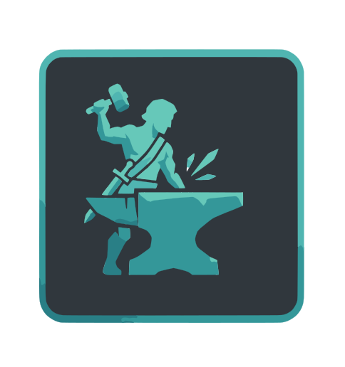

# Hephaestus



## Что это?

**Hephaestus** — интеллектуальная система для анализа вакансий и управления профессиональными навыками. Система автоматически собирает вакансии с HeadHunter, использует AI для извлечения требуемых навыков, нормализует и организует их по профессиям, а также генерирует карьерные траектории.

### Основные возможности

- **📋 Сбор вакансий** — интеграция с HeadHunter API, одна кнопка — и вакансии уже в базе
- **🤖 AI анализ** — искусственный интеллект извлекает требуемые навыки из описаний вакансий
- **🔧 Нормализация** — система унифицирует названия навыков ("JavaScript", "JS", "javascript" → "JavaScript")
- **👔 Управление профессиями** — организация навыков по направлениям и профессиям
- **📈 Карьерные траектории** — автоматическая генерация пути развития для каждой профессии
- **✅ Модерация** — контроль качества новых навыков перед добавлением в справочник
- **🔌 MCP интеграция** — подключение к Claude Code для умного ревью навыков
- **🧪 Тестирование AI моделей** — встроенная поддержка для экспериментов с разными LLM

## Как это работает

**Быстрое объяснение:** Система собирает вакансии, AI читает что там написано, извлекает нужные навыки, вы проверяете что это правильно, и навыки попадают в справочник. Потом система показывает как эти навыки связаны между собой и как развиваться по профессиям.

### Четыре стадии жизни навыков

1. **Сырая вакансия** 
   - Вакансия скачана с HeadHunter в исходном виде
   - Ещё никто её не обработал

2. **Извлечение AI** 
   - Система читает вакансию и говорит: "Здесь требуются вот эти навыки"
   - Навык попадает в очередь на проверку ("требует модерации")

3. **Модерация и нормализация** 
   - Вы смотрите на извлечённый навык
   - Решаете: это новый навык? Или это то же самое, что уже есть?
   - Пример: "React.js" и "React" — это один навык, его нужно нормализовать в "React"

4. **Справочник** 
   - Проверенный навык попадает в финальный справочник
   - Он связан с профессией и направлением развития
   - Готов для использования в аналитике и карьерных траекториях

### Каждый навык имеет

- **Каноническое имя** — как его звать (например, "JavaScript")
- **Синонимы** — альтернативные названия ("JS", "javascript", "яваскрипт")
- **Тип** — язык программирования, фреймворк, база данных, etc
- **Уровень** — Junior, Middle, Senior
- **Направление** — Frontend, Backend, DevOps, Data, etc
- **Профессия** — к какой профессии относится
- **Счётчик** — сколько раз этот навык встречается в вакансиях

### Поток данных

```
┌─────────────────────────────────────────────────────────────┐
│                                                             │
│  HeadHunter API  →  Сборка вакансий  →  PostgreSQL         │
│                          ↓                   (сырые         │
│                   AI извлечение навыков      данные)        │
│                          ↓                                  │
│              Очередь на модерацию                           │
│                          ↓                                  │
│         Вы проверяете и нормализуете       ← ВАША РОЛЬ     │
│                          ↓                                  │
│              Справочник проверенных                         │
│              навыков в PostgreSQL                           │
│                          ↓                                  │
│         Связи между навыками (графы)                        │
│         Карьерные траектории по профессиям                  │
│                                                             │
└─────────────────────────────────────────────────────────────┘
```

### Профессии и траектории

Система организует навыки по профессиям (Frontend Developer, Backend Developer, DevOps Engineer, etc). Для каждой профессии может быть автоматически сгенерирована **карьерная траектория** — рекомендуемый путь развития навыков от Junior до Senior уровня.

Например, для "Frontend Developer":
- Junior должен знать: HTML, CSS, JavaScript
- Middle добавляет: React, TypeScript, REST API
- Senior добавляет: архитектуру, менторство, системное проектирование

## Быстрый старт

### Требования

- **Docker** и **Docker Compose** (рекомендуется)
- Для локального запуска: **Node.js 16+**, **.NET 10+**, **PostgreSQL 16**
- **API ключи** для AI моделей:
  - OpenAI (опционально)
  - OpenRouter (опционально)
  - Groq (опционально)

### Запуск с Docker Compose (рекомендуется)

**Шаг 1: Настроить переменные окружения**

```bash
# Скопируй файл с примером (или создай сам)
cp .env.example .env

# Открой .env и заполни нужные переменные:
# DATABASE_URL=postgresql://...
# HEADHUNTER_ACCESS_TOKEN=...
# OPENROUTER_API_KEY=... (для AI)
```

**Шаг 2: Запустить все сервисы**

```bash
docker compose up
```

Откроется:
- **Backend API**: http://localhost:7168 (или https://localhost:7169)
- **PostgreSQL**: localhost:5432
- **Frontend** (если разворачивается отдельно): http://localhost:3001

**Шаг 3: Применить миграции (первый запуск)**

```bash
dotnet ef database update --project src/Hephaestus --startup-project src/Hephaestus
```

### Первые шаги

1. **Загрузить вакансии**
   ```bash
   curl -X GET "http://localhost:7168/api/vacancy/save?search=JavaScript"
   ```

2. **Извлечь навыки**
   ```bash
   curl -X POST "http://localhost:7168/api/skills/import-from-vacancies"
   ```

3. **Посмотреть навыки на проверке**
   ```bash
   curl -X GET "http://localhost:7168/api/skills/on-review"
   ```

4. **Одобрить навык**
   ```bash
   curl -X POST "http://localhost:7168/api/skills/on-review/{id}/approve" \
     -H "Content-Type: application/json" \
     -d '{"displayName": "JavaScript", "skillType": "Language", "direction": "Frontend"}'
   ```

> **Подробнее:** см. [FEATURES_GUIDE.md](docs/FEATURES_GUIDE.md)

### Для разработки (локально)

**Backend:**
```bash
cd src
dotnet restore
dotnet build
dotnet run --project Hephaestus/Hephaestus.csproj
```

**Frontend (если нужен):**
```bash
cd frontend
npm install
npm run dev
```

### Подключение MCP для Claude Code

```bash
# 1. Убедиться, что backend запущен
docker compose up

# 2. Добавить MCP сервер
claude mcp add hephaestus-skills --transport sse http://localhost:7168/mcp

# 3. Использовать в Claude Code
# Просто напишите в чате: "Помоги проверить навыки в Hephaestus"
```

> **Подробнее:** см. [mcp-setup.md](docs/mcp-setup.md)

## Структура проекта

```
Hephaestus/
├── src/
│   ├── Hephaestus/
│   │   ├── Features/              # Основные функции
│   │   │   ├── VacancyController/ # Управление вакансиями
│   │   │   ├── SkillManagement/   # Управление навыками
│   │   │   ├── ProfessionsManagement/ # Профессии
│   │   │   ├── TrajectoryGeneration/  # Траектории
│   │   │   ├── VacancyAiParsing/  # AI анализ
│   │   │   ├── SkillReviewMcp/    # MCP tools
│   │   │   └── OpenRouterClient/  # AI интеграция
│   │   ├── Infrastructure/        # Конфигурация и DI
│   │   └── Application/           # DbContext и миграции
│   └── Hephaestus.Domain/         # Доменные модели
│
├── frontend/                      # React UI (опционально)
├── docs/                          # Документация
│   ├── HOW_IT_WORKS.md           # Объяснение для гуманитариев
│   ├── SYSTEM_DIAGRAMS.md        # Диаграммы
│   ├── FEATURES_GUIDE.md         # Гайд по API
│   ├── skill_taxonomy.md         # Архитектура
│   └── mcp-setup.md              # Настройка MCP
│
├── compose.yaml                  # Docker Compose
├── .env.example                  # Пример переменных
└── README.md                     # Этот файл
```

## API endpoints и возможности

### Вакансии (`/api/vacancy`)
- `GET /vacancy` — список всех вакансий с пагинацией
- `GET /vacancy/skills` — все уникальные навыки из вакансий
- `GET /vacancy/{id}` — детали конкретной вакансии
- `POST /vacancy/save?search=...` — загрузить вакансии с HeadHunter
- `POST /vacancy` — добавить вакансию вручную
- `PUT /vacancy/{id}` — редактировать вакансию
- `DELETE /vacancy/{id}` — удалить вакансию

### Навыки (`/api/skills`)
- `POST /skills/import-from-vacancies` — извлечь навыки из необработанных вакансий
- `GET /skills/on-review` — список навыков, ожидающих проверки
- `GET /skills/clean` — список проверенных и нормализованных навыков
- `POST /skills/clean/add` — добавить новый навык в справочник
- `POST /skills/on-review/{id}/approve` — одобрить навык и добавить его
- `POST /skills/on-review/{id}/reject` — отклонить навык
- `GET /skills/generate-description?skillName=...` — сгенерировать описание навыка с помощью AI

### Профессии (`/api/professions`)
- `GET /professions` — список всех профессий
- `GET /professions/{id}` — детали профессии
- `POST /professions` — создать новую профессию
- `PUT /professions/{id}` — редактировать профессию
- `DELETE /professions/{id}` — удалить профессию

### Карьерные траектории (`/api/trajectory`)
- `POST /trajectory/generate` — сгенерировать карьерную траекторию для профессии

### Тестирование AI моделей (`/api/ai-models-testing`)
- Экспериментировать с разными LLM (OpenAI, OpenRouter, Groq)
- Сравнивать результаты на одних и тех же промптах

### MCP Tools
Подключение к Claude Code для ревью навыков через Model Context Protocol

## Решение проблем

### Backend не запускается

**Проблема:** Ошибка при `docker compose up`

**Решение:**
1. Убедись, что Docker запущен: `docker --version`
2. Посмотри логи: `docker compose logs hephaestus`
3. Проверь переменные в `.env`
4. Пересоздай контейнеры: `docker compose down && docker compose up --build`

### Вакансии не загружаются

**Проблема:** HeadHunter API не отвечает

**Решение:**
1. Проверь `HEADHUNTER_ACCESS_TOKEN` в `.env`
2. Убедись, что токен не устарел (обновить на HH.ru)
3. Попробуй позже (API может быть перегружен)
4. Используй другой поисковый запрос

### AI не извлекает навыки

**Проблема:** `import-from-vacancies` ничего не возвращает

**Решение:**
1. Проверь, что API ключи установлены в `.env`:
   - `OPENROUTER_API_KEY` (основной)
   - или `OPENAI_API_KEY`
   - или `GROQ_API_KEY`
2. Убедись, что у тебя есть баланс на аккаунте
3. Посмотри логи: `docker compose logs hephaestus`
4. Попробуй с меньшим количеством вакансий (limit=5)

### Миграция БД не применяется

**Проблема:** `dotnet ef database update` зависает или ошибается

**Решение:**
```bash
# Убедись, что PostgreSQL запущена
docker compose ps postgres

# Если нужно, переизучи миграции
dotnet ef migrations list --project src/Hephaestus

# Или пересоздай БД
docker compose exec postgres dropdb hephaestus -U postgres
docker compose up -d
dotnet ef database update --project src/Hephaestus
```

## Документация

- **[HOW_IT_WORKS.md](docs/HOW_IT_WORKS.md)** — объяснение системы для гуманитариев
- **[SYSTEM_DIAGRAMS.md](docs/SYSTEM_DIAGRAMS.md)** — визуальные схемы и диаграммы
- **[FEATURES_GUIDE.md](docs/FEATURES_GUIDE.md)** — подробный гайд по всем API
- **[skill_taxonomy.md](docs/skill_taxonomy.md)** — архитектура таксономии навыков
- **[mcp-setup.md](docs/mcp-setup.md)** — подключение к Claude Code

## Технологический стек

**Frontend:**
- React 18 + TypeScript
- Vite (быстрый build)
- React Query (управление данными)
- Tailwind CSS (стили)

**Backend:**
- **.NET 10** + **C#**
- **Entity Framework Core** (работа с БД)
- **PostgreSQL 16** (хранение данных)
- **Model Context Protocol (MCP)** для интеграции с Claude Code

**AI / LLM:**
- OpenAI API (GPT-4, GPT-3.5)
- OpenRouter (доступ к сотням моделей)
- Groq API (быстрые инференсы)
- Встроенная поддержка экспериментов с разными моделями

**Analytics (планируется):**
- ClickHouse (хранилище аналитики)
- Для больших объемов данных и быстрых запросов

---

## Текущие возможности

### ✅ Реализовано
- Сбор вакансий с HeadHunter
- AI-извлечение навыков из описаний
- Нормализация названий навыков и синонимы
- Модерация и контроль качества навыков
- Управление профессиями и направлениями
- Генерация карьерных траекторий
- MCP интеграция с Claude Code
- Тестирование разных AI моделей (OpenAI, OpenRouter, Groq)
- REST API для всех операций
- PostgreSQL как основное хранилище

### 🚀 В разработке
- ClickHouse интеграция для аналитики
- Расширенные графы связей между навыками
- Рекомендательная система для карьеры
- Тренды и статистика по рынку

### 📌 Планируется
- Frontend админка с UI для модерации
- Экспорт данных и отчёты
- Semantic search по навыкам
- Интеграция с другими job boards

---

## Контакты и помощь

Если что-то не работает:
1. Проверь логи в Docker: `docker compose logs`
2. Посмотри документацию в папке `/docs`
3. Перезагрузи контейнеры: `docker compose restart`
4. Или пересоздай с нуля: `docker compose down && docker compose up`

---

**Hephaestus** — интеллектуальная система для анализа рынка труда и управления профессиональными навыками. 

Собирай вакансии → Извлекай навыки → Нормализуй → Анализируй → Помогай развиваться 🔨
